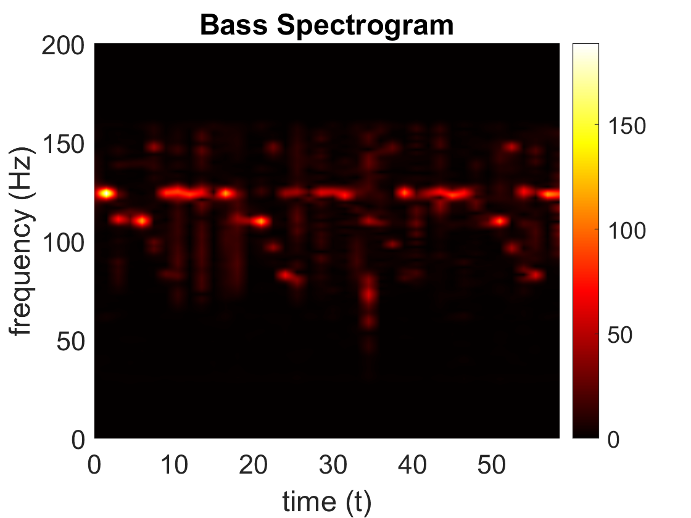
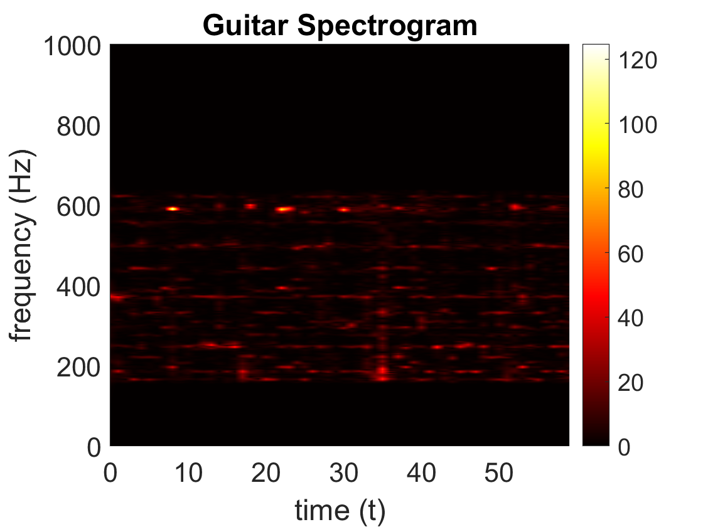
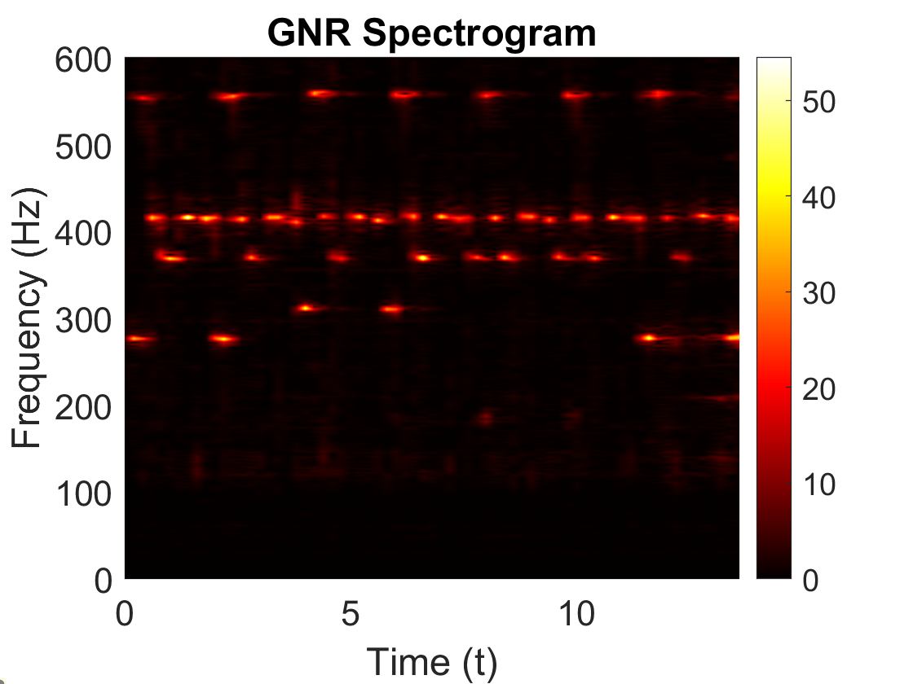

# Guitar-Audio-Visualization
## Problem
In this project the goal is to create visualizations of the guitar and bass notes played in two songs given the audio files for each song. The files we use are [Floyd.m4a](Floyd.m4a) and [GNR.m4a](GNR.m4a).

## Approach
We will create a frequency vs. time spectrograms that highlight which frequencies of notes are played at which times (similar to score sheets but more mathy). To do so, we first read in our audio
files as arrays representing an audio signals over time. We can then take Fourier Transforms of our signals to convert to the Fourier domain and filter out any undesired frequencies with a 
band pass filter. To filter out undesired frequencies for guitar notes, for example, we would eliminate frequencies present that are outside of the range of frequencies producible by 
the guitar used in the song. After filtering our signals, we will know which frequencies are present but not when each frequency is present. To determine times of each frequency, we use 
a Gabor Transform on our filtered signals, which gives us all of the data we need to create spectrograms of frequency vs. time.

## Results
The spectrograms produced from [Floyd.m4a](Floyd.m4a) with this appoach: 

  [GNR.m4a](GNR.m4a) does not have any bass but still has a guitar spectrogram: 

A formal write up of this problem including MATLAB algorithms, a theoretical background, and computational results can be found in [Guitar_Audio_Visualization.pdf](Guitar_Audio_Visualization.pdf)
